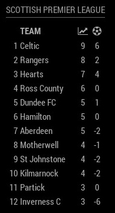

# MMM-ScottishPremierLeague
Scottish Premier League Standings Module for MagicMirror<sup>2</sup>

## Example



## Dependencies
  * An installation of [MagicMirror<sup>2</sup>](https://github.com/MichMich/MagicMirror)
  * npm
  * [request](https://www.npmjs.com/package/request)
  * [xml2js](https://www.npmjs.com/package/xml2js)

## Installation
 1. Clone this repo into `~/MagicMirror/modules` directory.
 2. Configure your `~/MagicMirror/config/config.js`:

    ```
    {
        module: 'MMM-ScottishPremierLeague',
        position: 'bottom_right',
        config: {
            api_key: 'ABC34689KLKDEGFO906SGFLSGFNM4EMP',
            ...
        }
    }
    ```
 3. Run command `npm install` in `~/MagicMirror/modules/MMM-ScottishPremierLeague` directory.

## Config Options
| **Option** | **Default** | **Description** |
| --- | --- | --- |
| `api_key` | REQUIRED | Get a free api key for the Scottish Premier League [here](http://www.xmlsoccer.com/Register.aspx). |
| `season` | `'1617'` | Which season should be displayed. |
| `focus_on` | `false` | Which team should the standings focus on e.g. "Rangers", "TOP" or "BOTTOM". Omit this option or set to false to show the full league table. |
| `max_teams` | `false` | How many teams should be displayed. Omit this option or set to false to show the full league table. |
| `updateInterval` | `10800000` (3 hours) | How often should the data be fetched |